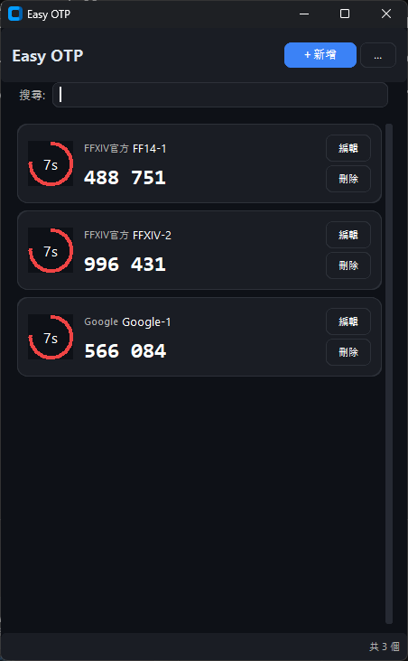

# Easy OTP

<p align="center">
  
  
  
</p>

現代化、美觀的 OTP (One-Time Password) 管理器，提供簡單易用的介面和強大的功能。



## ✨ 功能特點

- 🔐 **安全本地儲存** - 所有資料儲存在本地，無需網路連接
- 📷 **QR Code 支援** - 掃描 QR Code 快速導入 OTP
- 🎨 **現代化界面** - 深色主題，圓角設計，流暢動畫
- ⏱️ **視覺化倒數** - 圓形進度條顯示剩餘時間
- 📤 **多格式導出** - 支援 JSON、QR Code、CSV 格式
- 🔍 **即時搜尋** - 快速找到需要的 OTP
- 📋 **一鍵複製** - 點擊即可複製 OTP 代碼
- 🎯 **拖放支援** - 直接拖放圖片或檔案導入

## 🚀 快速開始

### 方式一：直接執行（推薦）

1. 下載最新的 `EasyOTP.exe`
2. 雙擊執行即可使用

### 方式二：從原始碼執行

1. 安裝 Python 3.8 或更高版本
2. 克隆專案：
   ```bash
   git clone https://github.com/yourusername/easy-otp.git
   cd easy-otp
   ```
3. 安裝依賴：
   ```bash
   pip install -r requirements.txt
   ```
4. 執行程式：
   ```bash
   python src/main.py
   ```

## 📦 打包執行檔

如果需要自行打包執行檔：

```bash
python build.py
```

打包完成後，執行檔會在 `dist/` 目錄下。

## 🛠️ 技術架構

- **GUI 框架**: CustomTkinter + Tkinter
- **OTP 處理**: PyOTP
- **QR Code**: pyzbar + qrcode
- **打包工具**: PyInstaller

## 📂 專案結構

```
easy-otp/
├── src/
│   ├── main.py              # 程式入口
│   ├── ui/                  # UI 相關
│   │   ├── main_window.py   # 主視窗
│   │   ├── components/      # UI 組件
│   │   └── themes/          # 主題設定
│   ├── core/                # 核心功能
│   │   ├── otp_manager.py   # OTP 管理
│   │   └── storage.py       # 資料儲存
│   └── utils/               # 工具函數
│       ├── qr_handler.py    # QR Code 處理
│       └── export_import.py # 導出導入
├── requirements.txt         # 依賴清單
├── build.py                # 打包腳本
└── README.md               # 說明文件
```

## 💡 使用說明

### 新增 OTP

1. **掃描 QR Code**：點擊「新增」→「上傳 QR Code」，選擇包含 OTP QR Code 的圖片
2. **手動輸入**：點擊「新增」→「手動輸入」，輸入標籤和密鑰
3. **拖放圖片**：直接將 QR Code 圖片拖放到應用程式視窗

### 使用 OTP

- 點擊 OTP 代碼即可複製到剪貼簿
- 圓形進度條顯示剩餘有效時間
- 使用搜尋框快速找到需要的 OTP

### 導出備份

1. 點擊右上角「⋮」按鈕
2. 選擇導出格式：
   - **JSON**：完整資料，可用於備份
   - **QR Code**：每個 OTP 生成一個 QR Code 圖片
   - **CSV**：表格格式，方便查看

## ⚠️ 注意事項

- Windows 用戶可能需要安裝 [Visual C++ Redistributable](https://support.microsoft.com/en-us/help/2977003/the-latest-supported-visual-c-downloads)
- 首次執行可能被防毒軟體誤報，請新增信任
- 請妥善保管導出的檔案，避免洩露

## 🤝 貢獻

歡迎提交 Issue 和 Pull Request！

## 📄 授權

本專案採用 MIT 授權條款。